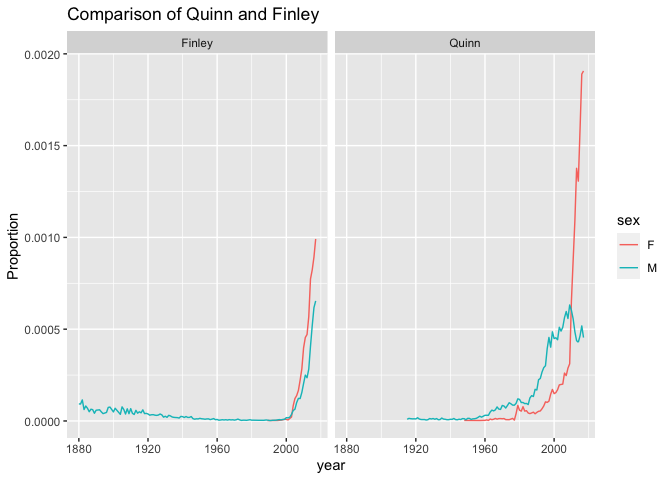

PS07
================

## GitHub Documents

This is an R Markdown format used for publishing markdown documents to
GitHub. When you click the **Knit** button all R code chunks are run and
a markdown file (.md) suitable for publishing to GitHub is generated.

## Including Code

*Joining two data frames*

``` r
library(nycflights13)
library(dplyr)
```

    ## 
    ## 载入程辑包：'dplyr'

    ## The following objects are masked from 'package:stats':
    ## 
    ##     filter, lag

    ## The following objects are masked from 'package:base':
    ## 
    ##     intersect, setdiff, setequal, union

``` r
data_distance_carrier <- flights %>% 
  group_by(tailnum, carrier)
data_seats <- planes %>% 
  group_by(tailnum) 
joined_flights <- data_seats %>% 
  inner_join(data_distance_carrier, by = "tailnum")
joined_flights
```

    ## # A tibble: 284,170 × 27
    ## # Groups:   tailnum [3,322]
    ##    tailnum year.x type     manufacturer model  engines seats speed engine year.y
    ##    <chr>    <int> <chr>    <chr>        <chr>    <int> <int> <int> <chr>   <int>
    ##  1 N10156    2004 Fixed w… EMBRAER      EMB-1…       2    55    NA Turbo…   2013
    ##  2 N10156    2004 Fixed w… EMBRAER      EMB-1…       2    55    NA Turbo…   2013
    ##  3 N10156    2004 Fixed w… EMBRAER      EMB-1…       2    55    NA Turbo…   2013
    ##  4 N10156    2004 Fixed w… EMBRAER      EMB-1…       2    55    NA Turbo…   2013
    ##  5 N10156    2004 Fixed w… EMBRAER      EMB-1…       2    55    NA Turbo…   2013
    ##  6 N10156    2004 Fixed w… EMBRAER      EMB-1…       2    55    NA Turbo…   2013
    ##  7 N10156    2004 Fixed w… EMBRAER      EMB-1…       2    55    NA Turbo…   2013
    ##  8 N10156    2004 Fixed w… EMBRAER      EMB-1…       2    55    NA Turbo…   2013
    ##  9 N10156    2004 Fixed w… EMBRAER      EMB-1…       2    55    NA Turbo…   2013
    ## 10 N10156    2004 Fixed w… EMBRAER      EMB-1…       2    55    NA Turbo…   2013
    ## # … with 284,160 more rows, and 17 more variables: month <int>, day <int>,
    ## #   dep_time <int>, sched_dep_time <int>, dep_delay <dbl>, arr_time <int>,
    ## #   sched_arr_time <int>, arr_delay <dbl>, carrier <chr>, flight <int>,
    ## #   origin <chr>, dest <chr>, air_time <dbl>, distance <dbl>, hour <dbl>,
    ## #   minute <dbl>, time_hour <dttm>

## Including Plots

*Linegraph of Babynames*

<!-- -->
